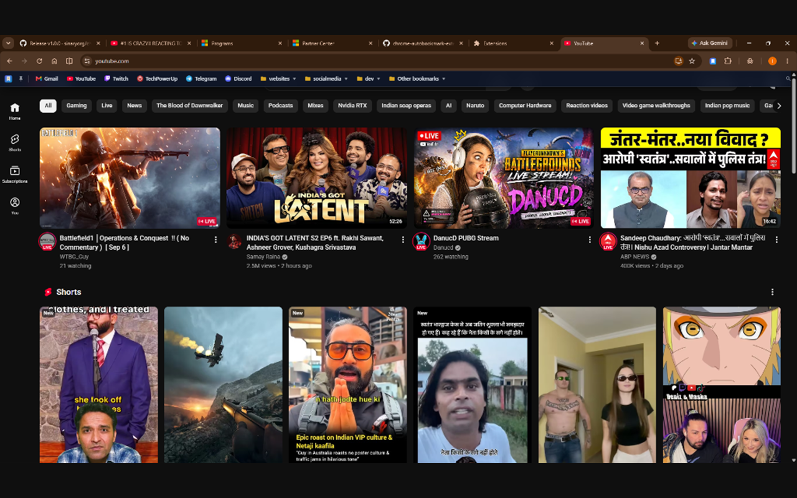
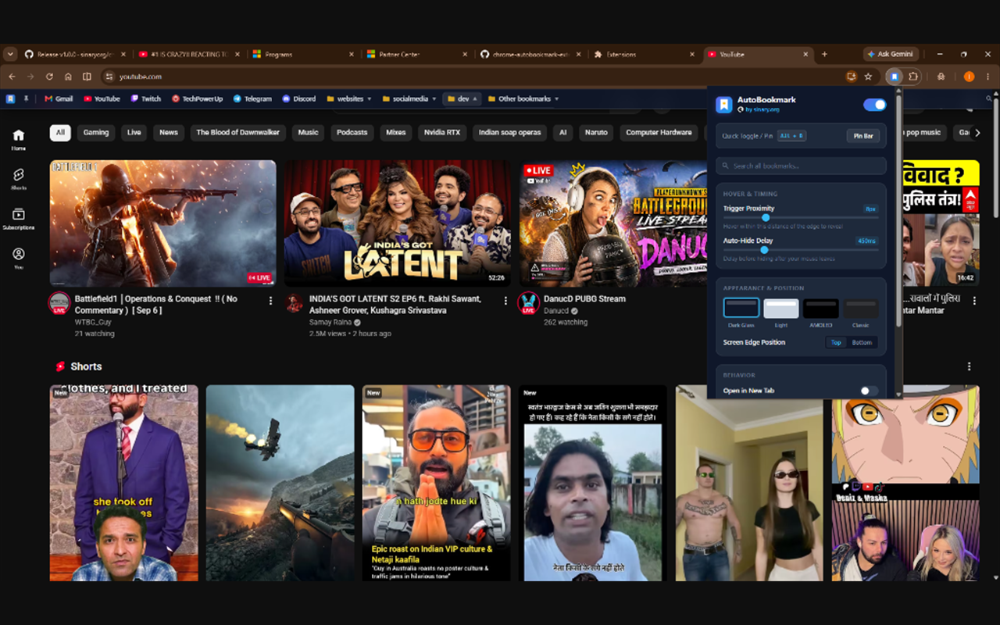

# AutoBookmark — by Sinary

> A smart, auto-hiding floating bookmark bar for **Chrome, Edge, Firefox, Brave, and Opera** crafted by the **[sinary.org](https://sinary.org/)** developer team.

<div align="center">

[](https://microsoftedge.microsoft.com/addons/detail/autobookmark-%E2%80%94-by-sinary/khedapggmjjlinfojcjebhmecaaikojo)
[](https://github.com/sinaryorg/chrome-autobookmark-extension/releases/latest)
[](LICENSE)

<br/>


</div>

---

## 🌐 Browser Compatibility

AutoBookmark is built with cross-browser compatibility and runs natively across all modern desktop browsers:

- ✅ **Google Chrome**
- ✅ **Microsoft Edge**
- ✅ **Mozilla Firefox**
- ✅ **Opera & Opera GX**
- ✅ **Brave Browser**
- ✅ **Vivaldi**
- ✅ **Arc Browser**

---

## ✨ Features

- **⚡ Hover-Activated Slide-in**: Move your cursor to the top edge of any webpage (within 8px) to reveal your bookmarks.
- **🍃 Smooth Auto-Hide**: Slides away smoothly when you move your cursor back into the page content.
- **🔀 Drag-and-Drop Organization**: Reorder bookmarks and folders on the fly with animated insertion guidelines and folder-drop targets.
- **🖱️ Right-Click Context Menu**: Full management at your fingertips — Open in New Tab, Edit Bookmark, Rename Folder, and Delete.
- **✏️ In-Place Edit & Rename**: Update titles and URLs directly from the bar with sleek glassmorphic modal dialogs.
- **📁 Multi-Level Folder Dropdowns**: Browse deep nested subfolders with seamless connected flyout portals.
- **🔍 Connected Search with Bevel**: Instant bookmark search connected seamlessly to the navbar with a curved bevel fillet and glass highlight.
- **📌 Pin Anytime**: Press <kbd>Alt + B</kbd> or click the 📌 pin button to keep the bar visible while working.
- **🛡️ 100% Shadow DOM Isolated**: Injected with an open Shadow DOM root — zero CSS conflicts with any website.
- **🎨 4 Curated Themes**: Dark Glass, Modern Light, AMOLED Black, and Classic Chrome.
- **⚡ Privacy-First**: 100% local in-browser execution. No data is ever collected or transmitted.

---

## 📸 Preview & Screenshots

### 1. Auto-Hiding Floating Bookmark Bar
*Reveals your bookmarks and nested folders smoothly on hover, then gracefully hides away to preserve full-screen viewing space:*



### 2. Customization & Themes
*Fine-tune hover proximity, auto-hide timing, toggle pin shortcut (<kbd>Alt + B</kbd>), and switch between 4 themes (Dark Glass, Modern Light, AMOLED Black, Classic Chrome):*



---

## 🚀 How to Get AutoBookmark

You can install AutoBookmark using either the official stores or directly from GitHub Releases:

### Method 1: Official Browser Stores (Recommended — 1-Click Install & Auto-Updates)

| Store | Recommended Browser | Status |
| :--- | :--- | :--- |
| **Microsoft Edge Add-ons** | Microsoft Edge | 🟢 **[Install from Edge Store](https://microsoftedge.microsoft.com/addons/detail/autobookmark-%E2%80%94-by-sinary/khedapggmjjlinfojcjebhmecaaikojo)** (Live) |
| **Opera Add-ons** | Opera & Opera GX | In Review ([View Store](https://addons.opera.com)) |
| **Mozilla Firefox Add-ons (AMO)** | Mozilla Firefox | In Review ([View Store](https://addons.mozilla.org)) |

> [!NOTE]
> **For Google Chrome users**: Google restricts direct 1-click webstore installs exclusively to its own Chrome Web Store. To use AutoBookmark in Chrome for free, use **Method 2 (Direct GitHub Release)** below — it takes only 10 seconds to load into `chrome://extensions` and runs with 100% native performance!

---

### Method 2: Direct GitHub Releases (No Store Required)

Every release provides two dedicated packages tailored for specific browser engines:

👉 **[Download Latest GitHub Release](https://github.com/sinaryorg/chrome-autobookmark-extension/releases/latest)**

#### 📦 For Chrome, Edge, Brave, Opera, Vivaldi (`AutoBookmark-v1.1.0.zip`)
1. Download **`AutoBookmark-v1.1.0.zip`** from the latest release.
2. Unzip `AutoBookmark-v1.1.0.zip` into a folder on your computer.
3. Open your browser's extension page:
   - **Chrome**: `chrome://extensions`
   - **Edge**: `edge://extensions`
   - **Brave**: `brave://extensions`
   - **Opera**: `opera://extensions`
4. Toggle ON **Developer mode** (top-right corner switch).
5. Click **"Load unpacked"** (top-left) and select the extracted folder.

#### 🦊 For Mozilla Firefox (`AutoBookmark-firefox-v1.1.0.zip`)
1. Download **`AutoBookmark-firefox-v1.1.0.zip`** from the latest release.
2. Open Firefox and navigate to:
   ```text
   about:debugging#/runtime/this-firefox
   ```
3. Click **"Load Temporary Add-on..."** (top-right).
4. Select the downloaded `AutoBookmark-firefox-v1.1.0.zip` file directly (or extract and select its `manifest.json`).
5. Done! The AutoBookmark bar is active immediately on Firefox.

---

## 💡 Essential Pro Tip: Hide Your Browser's Default Bookmark Bar

To get the full immersive experience and **reclaim 100% of your vertical screen real estate**, turn off your browser's default static bookmark bar.

AutoBookmark replaces the static bar by floating smoothly into view **only when you hover near the top edge**!

### ⚡ Quick Shortcut (All Browsers)
Press **<kbd>Ctrl</kbd> + <kbd>Shift</kbd> + <kbd>B</kbd>** (Windows / Linux) or **<kbd>Cmd</kbd> + <kbd>Shift</kbd> + <kbd>B</kbd>** (macOS) to instantly toggle off the default bar.

### 🛠️ Browser-Specific Step-by-Step Guide

| Browser | How to Hide the Default Bookmark Bar |
| :--- | :--- |
| **Google Chrome** | Press <kbd>Ctrl+Shift+B</kbd>, or click `⋮` (Three dots) > **Bookmarks and lists** > uncheck **"Show bookmarks bar"**. |
| **Microsoft Edge** | Press <kbd>Ctrl+Shift+B</kbd>, or click `...` (Three dots) > **Favorites** > click `...` at top > select **Hide favorites bar** > **Never**. |
| **Mozilla Firefox** | Press <kbd>Ctrl+Shift+B</kbd>, or right-click any blank space in the tab bar > **Bookmarks Toolbar** > select **"Never Show"**. |
| **Opera & Opera GX** | Press <kbd>Alt+P</kbd> (Settings) > search **"Bookmarks"** > toggle off **"Show bookmarks bar"**. |
| **Brave Browser** | Press <kbd>Ctrl+Shift+B</kbd>, or go to **Settings** > **Appearance** > toggle off **"Show bookmarks bar"**. |

Once hidden, simply glide your mouse cursor to the top edge of any page to summon your floating bookmarks on demand!

---

## ⌨️ Keyboard Shortcuts

| Shortcut | Action |
| :--- | :--- |
| <kbd>Alt + B</kbd> | Toggle / Pin the AutoBookmark bar |

---

## ⚙️ Extension Settings

Click the **AutoBookmark** icon in your browser toolbar to customize:
- **Trigger Proximity**: Adjust sensitivity (2px to 25px from the top edge).
- **Auto-Hide Delay**: Configure hide duration (100ms to 1500ms).
- **Appearance Themes**: Switch between Dark Glass, Modern Light, AMOLED Black, and Classic Chrome.
- **Position**: Place on the Top or Bottom screen edge.
- **Behavior**: Choose whether bookmarks open in the current tab or a new tab, toggle website favicons, and toggle bookmark URL previews on hover.

---

## 🛠️ Tech Stack & Architecture

- **Manifest V3**: Pure modern extension standards using background service workers and declarative storage.
- **Shadow DOM**: Complete style and layout encapsulation from the host webpage.
- **Native Browser APIs**: `chrome.bookmarks`, `chrome.storage.sync`, and `chrome.commands`.

---

## 🌐 Sinary Ecosystem

AutoBookmark is developed and maintained by the **[sinary.org](https://sinary.org/)** developer team — building privacy-focused apps, digital tools, and browser extensions.

- **Website**: [https://sinary.org](https://sinary.org)
- **GitHub**: [https://github.com/sinaryorg](https://github.com/sinaryorg)
- **Privacy Policy**: [PRIVACY_POLICY.md](PRIVACY_POLICY.md)
- **Roadmap & Next Update**: [ROADMAP.md](ROADMAP.md)

---

## 📦 Version History & Release Notes

### 🚀 Version 1.1.0 *(Current Release)*

Version 1.1.0 is a major update adding full in-place bookmark management, drag-and-drop reordering, and multi-level subfolder navigation:

- **🔀 Drag-and-Drop Bookmark Organization**:
  - Reorder bookmarks directly on the floating bar, inside folder dropdowns, and within nested submenus.
  - Drop bookmarks onto folders to organize them instantly.
  - Live animated drop indicator guidelines indicating exact insertion points.
  - Accurate index boundary math ensuring proper placement when moving items to the top, middle, or bottom of folders.
- **🖱️ Custom Right-Click Context Menu**:
  - Modern glassmorphic context menu for bookmarks, folders, and subfolders.
  - **Open in New Tab**: Quickly open any bookmark in a new background or foreground tab.
  - **Edit Bookmark / Rename Folder**: Launch centered glassmorphic modal editors to update bookmark titles and URLs or folder names.
  - **Delete Bookmark / Delete Folder**: Safe deletion with confirmation dialogs (including recursive folder cleanup for non-empty folders).
- **📁 Multi-Level Subfolder Navigation**:
  - Deep nested subfolder support with seamless flyout portals.
  - Connected concave fillet wings matching parent dropdowns with zero gap.
  - Smart hover de-escalation: hovering over regular bookmarks or bar controls automatically dismisses open folder dropdowns.
- **🛡️ Stacking & Z-Index Architecture**:
  - Stratified Shadow DOM z-index hierarchy ensuring context menus and modals always render strictly above all submenus and dropdowns.
  - Prevents menus from hiding behind subfolder portals or closing prematurely during interaction.

---

### 🌟 Version 1.0.0 *(Initial Release)*

- Hover-activated auto-hiding floating bookmark bar.
- Shadow DOM isolation preventing styling conflicts with host websites.
- 4 curated themes (Dark Glass, Modern Light, AMOLED Black, Classic Chrome).
- Connected search bar with curved bevel fillet highlight.
- Quick pin shortcut (<kbd>Alt + B</kbd>) and toolbar pin button.
- Cross-browser support for Chrome, Edge, Firefox, Brave, Opera, and Vivaldi.

---

## 🗺️ Roadmap & Upcoming Features

We are continually improving AutoBookmark! Check out **[ROADMAP.md](ROADMAP.md)** for planned future updates (v1.2.0+), including "+ New Folder" buttons, "Open All in Tabs" batch folder actions, and bookmark count badges!

---

## 📄 License

MIT License. Open source and free to use.
